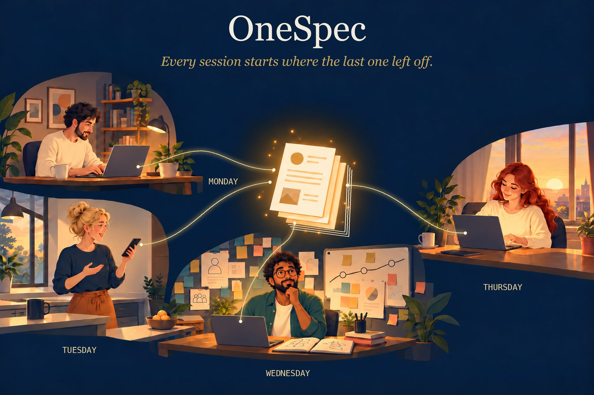

# OneSpec

**One shared spec for your team and every AI it works with.**



> **Status: beta, in development.** The practice described here is in daily use and you can adopt it
> today by copying the layout below. The `onespec` command-line tool (`init`, `index`, `check`) and the
> agent instructions are being built now and will land in this repo. More at
> [pikelabs.ai/onespec](https://pikelabs.ai/onespec).

Every AI session starts from zero. You spend the first part of it re-explaining the system, the
customer, and what was decided last week, and when the session ends, what you worked out together
goes with it. With several people each running their own sessions, the loss multiplies: nobody's
agent knows what anyone else's agent learned.

OneSpec fixes that with a small folder of plain-Markdown documents, `doc/spec/`, kept next to the
code. It records what the system is for, how it is shaped, and why it was built that way. Every
session, human or AI, starts by reading it, and the work that matters gets written back before the
session ends. The knowledge carries forward from one session to the next, and from one person to
the next.

---

## Why

**Continuity beyond the session.** This is the main point.

- **Working alone,** a new session starts at full speed. The agent reads a few pages instead of
  re-deriving the system from the code, so it uses little of its context window getting oriented
  and has more left for the actual work. What you decide today is waiting for tomorrow's session.
- **Working as a team,** the spec carries everyone's relevant work. When a colleague's session
  settled a design question yesterday, your session knows the answer today, without anyone
  writing a hand-off note or remembering to mention it.

Three more benefits come with it:

1. **One picture of the system for people and agents alike.** A new engineer, a product owner, or
   a fresh AI session gets oriented from the same few documents in minutes.
2. **Decisions that survive.** Important choices become short decision records that are never
   edited, only replaced. The reasons outlive turnover, reorganizations and context windows.
3. **No allegiance to any tool or model.** It is Markdown and a few conventions. Your team can use
   Claude, GPT, Gemini or whatever comes next, side by side, and the spec stays the same.

## Not just for engineers

Some of the most valuable content in a spec is business context: who the customers are, what
problem the system solves for them, what a term means in this business, which constraints come
from contracts or regulation. Engineers often don't have that knowledge. Product owners and
business people do.

OneSpec is written in plain language so they can read it and write in it, especially the
`purpose/` section, which is where that context lives. This matters more every year: a growing
share of the people building software with coding agents are business people, not career
engineers. The spec is how their knowledge reaches every session, including the ones they never
see.

## How a session goes

This is the habit that makes it work. It is not obvious, so here it is step by step.

**1. Start with the problem, and have the agent read the spec first.** For example:

> Today we're going to extend billing so it can handle Acme's invoices in euros and pounds.
> Before we start, read `billing/doc/spec`, and also `storefront/doc/spec` to see how the
> storefront uses billing. Then let's brainstorm. I was thinking we could store each amount in its
> original currency and convert only when reporting. Will that work, and what else would it
> affect?

The problem can be deeply technical or purely about the business, such as growing a system to
meet a new customer's needs. Either way, the agent starts from the recorded purpose, design and
past decisions, not from guesses. It reads the index and the few documents that matter, not the
whole codebase.

**2. Brainstorm.** Talk it through. Let the agent push back, raise consequences you hadn't
considered, and suggest alternatives. This is where the real thinking happens, and it goes better
when the agent knows why the system is the way it is.

**3. Update the spec.** Once you've settled on an approach, ask the agent to record it: a new
decision record for the choice and why, and changes to the design documents it affects. Do this
*before* building, while the reasons are fresh.

**4. Build it.** Now the agent builds, with the agreed design written down in front of it.

**5. Check the spec before you commit.** Ask the agent to update the spec (`/update-spec`). Usually
nothing more needs to change. Sometimes building taught you something the spec should know.

The next session, yours or a teammate's, starts at step 1 with everything this one learned.

## Getting started

Install the command-line tool (Python 3.9 or later, no other dependencies). *Coming with the first
release; until then, create the `doc/spec/` folders from [The shape](#the-shape) by hand and ask your
agent to follow this README.*

```
pipx install onespec
```

From the root of your repo, set up the empty structure:

```
onespec init
```

`init` creates `doc/spec/` with short starter files and adds a section to `AGENTS.md` telling
every coding agent how to use the spec. Then ask your agent to **create the spec** (`/create-spec`
in tools that support commands; in others, ask it to "create the spec following
doc/spec/README.md"). It works like a session in the previous section: a conversation, not a form.

- **Existing code, no spec.** The agent reads the code and drafts the overview, the architecture,
  and the decisions it can see evidence for. Then it asks you what the code can't tell it: who the
  system is for, why the odd parts are odd, which decisions were deliberate. You correct the draft
  together. Bring a product owner for the purpose section if you can.
- **New project.** Start with the problem and brainstorm as above. As the design firms up, the
  agent records the purpose, the architecture and each decision as it is made.
- **A design already written elsewhere.** Point the agent at it. It turns the design into the
  overview, architecture and decision records, so the design stays current once code lands
  instead of becoming a document nobody reopens.

## The shape

```
doc/spec/
  README.md          the rules for this repo (the one rule, what goes where)
  INDEX.md           generated map: one line per document, read this first
  RELATED.md         optional: specs in other repos this one depends on
  backlog.md         known work you owe but haven't scheduled (changes freely)
  purpose/           why the system exists: overview, customers, glossary
  constitution/      how we build here: conventions, tech stack, standing rules
  design/            what we're building: architecture, one doc per area, status
  adr/               why this over that: numbered decision records, never edited
```

Everything else in `doc/` stays free-form. The rules apply only inside `doc/spec/`.

Each document starts with a few lines saying what it is for. The index is built from them, so an
agent can find the right document without opening every one:

```markdown
---
purpose: "How invoices are created, priced and sent; currency handling."
concepts: [invoice, pricing, currency, tax]
owns: [src/billing/invoice/, src/billing/currency/]
---
# Invoicing
```

A few conventions carry most of the weight:

- **Each design document names the code it governs** (`owns:`), so a changed file can be traced to
  the document that describes it, and a document pointing at deleted code gets caught.
- **Build status lives in one place,** `design/status.md`. Status notes scattered through design
  documents are the first thing to go stale.
- **Decision records are never edited.** To change a decision, write a new record that replaces
  the old one. When you cite a record from another repo, name the repo: `billing ADR-0004`, never
  a bare number.

## The one rule

> Touch the spec only if a reader tomorrow would form a materially different picture of the
> system without the change.

The default is no. Bug fixes, refactors, renames, new tests and dependency updates almost never
qualify. New components, new connections between parts, reversed decisions, new customers'
requirements and new conventions usually do. The rule is as much about when not to write as when
to, and it is what keeps the spec short enough to read at the start of every session.

## What it is not

OneSpec does not tell an AI how to plan, think, or break down work. Some spec tools walk the model
through a fixed sequence (specify, plan, task, implement). That kind of scaffolding gets in the
way as models improve.

OneSpec manages **what the team knows**, not **how the work gets done**. Better models make that
more valuable, not less: no model, however capable, can recover a decision that was never written
down. And the better models get at writing, the more a project needs a rule about when *not* to
write.

The test for every feature in this project: *would it still be useful if models were ten times
smarter?*

## Day to day

**Agents read before they decide.** The section `init` adds to `AGENTS.md` tells every agent to
check the spec before settling any design question, and to answer from it rather than re-derive
it. Agents still forget mid-session; when one starts guessing, point it back at the spec.

**Agents write before you commit.** `/update-spec` reads the change and the conversation behind
it, applies the one rule, and either edits the one or two documents that should move or tells you
nothing needs to change. "Nothing needs to change" is the common, correct answer.

**The mechanical checks need no AI.** `onespec check` verifies that the opening lines of each
document are valid, `INDEX.md` is current, every `owns:` path still exists, no two decision
records share a number, and status lives only in `status.md`. Run it locally, in a git hook, or
in CI.

```
onespec index     # rebuild INDEX.md
onespec check     # run the mechanical checks
```

A commit hook is available. It only advises by default. Put `[skip-spec]` in a commit message to
record that you considered the spec and nothing needed to change.

## Teams and branches

When two branches both change the spec, ask your agent to **reconcile the spec**
(`/reconcile-spec`). It renumbers clashing decision records and rebuilds the index. Where both
branches edited the same design document, it merges what they say rather than line by line. Where
the two branches made *opposing* decisions, it does not pick a winner: it stops and puts the
conflict in front of the people who made them.

## Large repos

In a monorepo, give each major part its own `doc/spec/`, and keep one at the root that describes
how the parts fit together and points to each part's spec. Decision records are numbered within
each part and cited with the part's name from elsewhere, the same as across repos. `onespec index`
at the root finds the nested specs and lists them.

## Works with any agent

The rules are written for any reader, not for one product. `onespec init` adds a short section to
`AGENTS.md`, which most coding agents read. It can also add small adapters for tools that use
their own files: Claude Code (`CLAUDE.md` and commands), Cursor rules, GitHub Copilot
instructions. The adapters only point at `doc/spec/`; nothing is written twice.

## Upgrading, and stopping

`onespec check` reports which version of the layout a repo uses, and `onespec upgrade` moves an
older layout forward.

To stop using OneSpec, delete `doc/spec/` and the OneSpec section of `AGENTS.md`. Nothing else
depends on it.

## Status

Beta. The practice has been in daily use since spring 2026 across nine repositories, from a
coding-agent harness to a production data service, with specs written before the code, alongside
it, and after it. The tooling around it is new.

More at [pikelabs.ai/onespec](https://pikelabs.ai/onespec).

## License

Apache License 2.0. Copyright 2026 Pike Labs, Inc.
